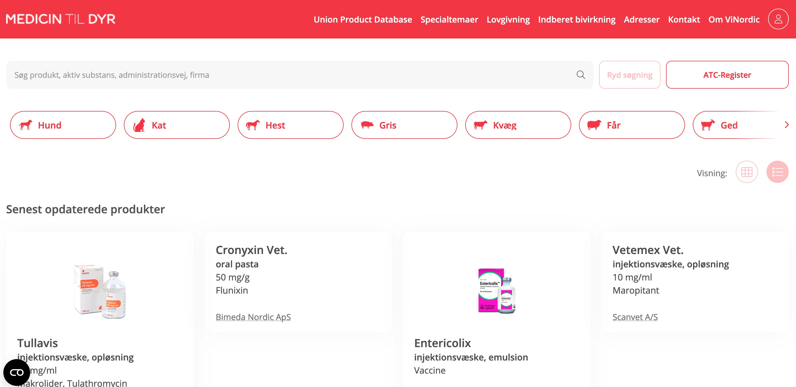

# Web Scraping MEDICIN TIL DYR Using Selenium in Python

## Project Description
This project focuses on data scraping from [MEDICIN TIL DYR](https://medicintildyr.dk/), which provides price data for antimicrobrials. Data was scraped using Selenium in Python since data of interest was on JavaScript rendered pages. The goal of this project is to extract relevant antimicrobial price data for pigs, showcasing the potential and usage of web scraping in data analysis.

## Dependencies
* Python (3.x recommended)
* Selenium
* Chrome WebDriver (or any other driver based on the target browser)
* Pandas

## Setup and Installation
1. Ensure you have Python installed. If not, download and install Python from [official site](https://www.python.org/).
2. Install Selenium. Use pip for easy installation:
    ```bash
    pip install selenium
    ```
3. Download Chrome WebDriver from [here](https://sites.google.com/a/chromium.org/chromedriver/). 

## How to Run
1. Clone this repository.
2. Navigate to the directory.
3. Run the scripts as articulated in the section below.

## Code Overview
This project uses Selenium for simulating browser activities, thereby fetching data from the JavaScript rendered page.

### Gathering URLs 

Each product is on its own page, and has its own url. The first stage was to gather all urls from the product overview page (Figure 1), so we could later scrape data specific to each product. 

`scrape.py` uses selenium to dynamically scroll the product page, and gathers all urls for the product pages. The result is a csv file with a column of urls (data/urls.csv).


*Figure 1. - The overview page that shows all the products.*


### Filter drugs 

Our inclusion criteria for the data was drugs that were relevant to pigs, and that had price data. Therefore, the next step was to shortlist the urls, excluding all products that were not relevant to pigs, and did not have price data.

`scrape-product.py` takes the list of urls from `data/urls.csv` and visits each one in turn. For each product page, it checks if the product is relevant to pigs and whether it has price data available. The output is a csv file with these columns: title, subtitle, obsolete_price, url, species_svin, species_gris. 

obselete_price, species_svin, and species_gris are boolean values. 
* if obselete_price = True, the price data is obselete (not available); if obselete_price = False, the price data is available
* if species_svin = True, the drug is relevant to 'svin' (pig); if species_svin = False, the drug is not relevant to svin
* if species_gris = True, the drug is relevant to 'gris' (piglet); if species_gris = False, the drug is not relevant to gris

`explore-price-info.ipynb` explores the data to determine which, and how many entries have price data and data related to pigs. If both conditions are met, the url is saved to a new file, `data/filtered_urls.csv`.

### Get price data 

`scrape-pigs.py` each url that has price and refers to pigs was visited via selenium, and the following information was gathered: 

* pakning (en: packing)  
* nvr 
* price 
* atc-kode
* url

The subtitle and title information was then merged with the information gathered based on the url using `merge-output.py`. The result is `data/price_pigs_full.csv`. 

## Contact Information

For any additional questions or comments please email me at kraymond@uoguelph.ca 

## License 

This project is licensed under GNU LESSER GENERAL PUBLIC LICENSE


